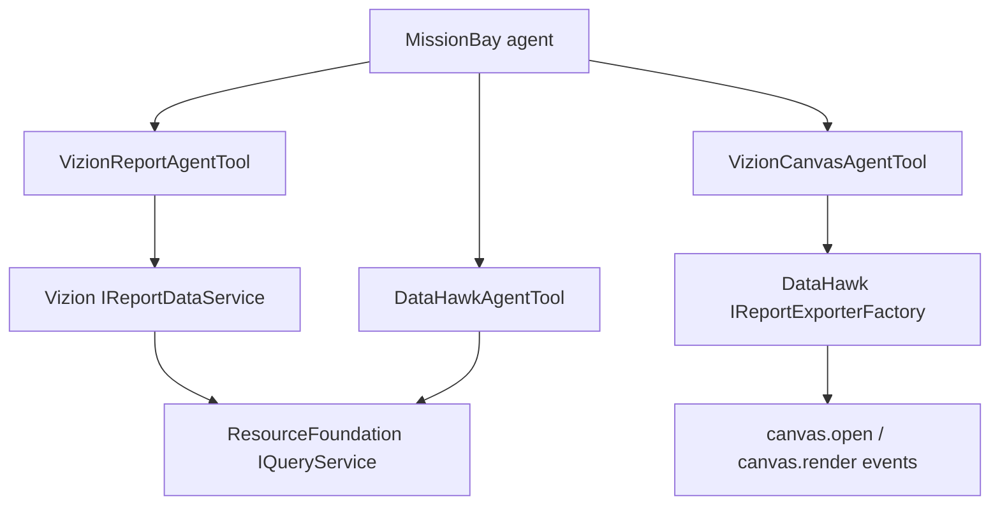

# MissionBayReporting

## Purpose

MissionBayReporting is a MissionBay extension package for reporting and visualization use cases.

Its primary curated-report integration is `VizionReportAgentTool`, which exposes finished Vizion reports through Vizion's headless `IReportDataService`. `DataHawkAgentTool` remains available for ad-hoc analytical queries through the neutral `ResourceFoundation` query contracts.

The package also retains Vizion-oriented canvas resources and a DataHawk report node for installations that use the older/report-rendering flow path.

## Architecture



The important current boundary is that `DataHawkAgentTool` does not depend on a concrete DataHawk query implementation for data access. It depends on:

```text
ResourceFoundation\Api\IQueryService
```

This keeps the agent tool reusable with any project implementation that fills the ResourceFoundation query slot.

## Plugin initialization

`MissionBayReportingPlugin::init()` only registers the plugin object itself.

The reporting classes are discoverable through the BASE3 class map and are normally instantiated as MissionBay component presets or flow nodes. The plugin does not create a second service registry.

## Vizion report agent tool

Technical resource name:

```text
vizionreportagenttool
```

It exposes three read-only functions:

```text
describe_vizion_reports
execute_vizion_report
search_vizion_tree
```

Use this tool first when a user request can be answered by an existing Vizion report. It uses the same vdef, filters, tree filters, sorting, paging and secured query path as the ModularGrid web display.

See [docs/vizion-report-agent-tool.md](docs/vizion-report-agent-tool.md).

## DataHawk agent tool

Technical resource name:

```text
datahawkagenttool
```

It exposes two read-only functions:

```text
describe_reporting_data
execute_datahawk_query
```

The intended usage is on demand:

1. the agent receives a reporting question
2. if schema is not already known from recent tool context, it calls `describe_reporting_data`
3. it selects the exact technical schema and table pair returned by discovery
4. it calls `execute_datahawk_query` with a structured SELECT object containing that exact `schema`
5. the tool returns rows, columns, sensitivity metadata and effective result limits

The full reporting schema is not injected into every assistant call.

See [docs/datahawk-agent-tool.md](docs/datahawk-agent-tool.md).

## Read-only query boundary

`DataHawkAgentTool` validates the structured query before it reaches `IQueryService`.

Current allowed element types:

```text
fld
fn
op
subquery
case
windowfn
```

Only SELECT-style reporting queries are accepted. Write operations and unrestricted raw SQL are not part of the tool contract.

See [docs/query-contract-and-security.md](docs/query-contract-and-security.md).

## Component preset configuration

The tool implements `ISchemaProvider` and can be configured as a normal MissionBay component preset.

Supported settings:

```text
reportingscope
priority
domainFilter
categoryFilter
tagFilter
tableFilter
describeLimit
defaultLimit
maxLimit
```

Current defaults:

```text
priority = 60
describeLimit = 8
maximum describeLimit = 20
defaultLimit = 100
maxLimit = 1000
```

If `defaultLimit` is configured above `maxLimit`, the runtime clamps the default to the hard maximum.

`reportingscope` and all filter values are resolved through `IAgentConfigValueResolver`. The reporting scope id is required and is resolved through `IReportingScopeRegistry` to its technical query-schema scopes.

See [docs/configuration.md](docs/configuration.md).

## Schema discovery

`describe_reporting_data` searches reporting schema metadata, not business data values.

Good search concepts:

```text
user
course
certificate
learning progress
```

A person name or arbitrary database value is not a schema search term.

After a candidate is found, the tool should be called with the exact returned table name to obtain full field and relation metadata.

The agent must not invent physical/source table names.

## Query execution

`execute_datahawk_query` expects:

```json
{
  "query": {
    "type": "select",
    "table": "exact_table_returned_by_discovery",
    "fields": [],
    "limit": 100
  }
}
```

The `query` value must be an object, not a JSON-encoded string.

The tool returns structured data and does not expose generated SQL as its normal model-facing result.

## Sensitivity metadata

MissionBayReporting preserves ResourceFoundation sensitivity metadata. It does not automatically remove sensitive fields if the active project query scope exposes them.

Authorization and reporting data scope therefore remain project/backend responsibilities. The agent tool enforces its configured table/domain/category/tag scope and read-only query contract, but it is not a replacement for backend authorization.

## Vizion canvas tool

Technical name:

```text
vizioncanvasagenttool
```

Tool function:

```text
vizion_report_canvas
```

It uses `IReportExporterFactory` to render a table/chart report and publishes it to the chatbot event stream through:

```text
canvas.open
canvas.render
```

The tool currently supports report types:

```text
table
datatable
piechart
barchart
```

See [docs/vizion-integration.md](docs/vizion-integration.md).

## Vizion memory resource

Technical name:

```text
vizionmemoryagentresource
```

This resource is a legacy/current-compatibility memory resource that injects canvas/report usage rules and a schema-derived example as a system message.

For normal on-demand reporting, the memory now prefers `VizionReportAgentTool` when a finished Vizion report matches the request and falls back to `DataHawkAgentTool` for ad-hoc analysis.

## DataHawk report node

Technical name:

```text
datahawkreportnode
```

This AgentFlow node accepts a JSON config string, resolves a DataHawk exporter and returns rendered report output, columns and SQL. It is a flow/reporting integration and is distinct from the safer model-facing `DataHawkAgentTool` contract.

See [docs/report-node.md](docs/report-node.md).

## Documentation map

* [docs/overview.md](docs/overview.md)
* [docs/vizion-report-agent-tool.md](docs/vizion-report-agent-tool.md)
* [docs/datahawk-agent-tool.md](docs/datahawk-agent-tool.md)
* [docs/query-contract-and-security.md](docs/query-contract-and-security.md)
* [docs/configuration.md](docs/configuration.md)
* [docs/vizion-integration.md](docs/vizion-integration.md)
* [docs/report-node.md](docs/report-node.md)
* [docs/api-reference.md](docs/api-reference.md)
* [docs/faq.md](docs/faq.md)
* [PRIVACY.md](PRIVACY.md)

## Design rules

* Prefer finished Vizion reports when they already model the requested business question.
* Prefer on-demand schema discovery over injecting the full reporting schema into every prompt for ad-hoc DataHawk analysis.
* Depend on ResourceFoundation query contracts for model-facing reporting data access.
* Keep model-facing reporting read-only unless a separate deliberately reviewed mutation tool is introduced.
* Configure reporting scope through normal MissionBay component presets.
* Do not add a second reporting memory/profile architecture just to scope one tool instance.
* Treat Vizion canvas rendering as a UI integration, not as the data authorization boundary.

## License

GPL-3.0.
